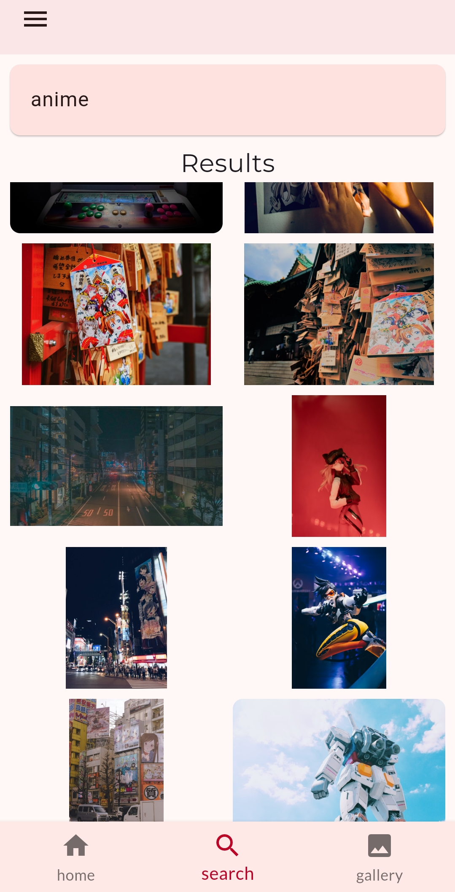

# 🌟 Wallfeast

 
 

Welcome to **Wallfeast** - your gateway to a world of stunning wallpapers and inspirational photos! 🌅 Whether you're looking to refresh your device's look or seeking daily visual inspiration, Wallfeast has you covered.

## 🎨 Features

- **Find Beautiful Wallpapers**: Discover a vast collection of beautiful wallpapers.
- **Daily Curated Photos**: Enjoy a daily feed of  high-quality photos to spark your creativity.
- **Download Your Favorites**: Save your favorite wallpapers and photos directly to your device (*available in release builds*).

## 📥 Get Started

To start exploring beautiful wallpapers and photos, download the latest release of Wallfeast [here](https://github.com/rahulsingh2031/wallfeast/releases).

## 📸 Screenshots

    
    
    

## 🚀 Installation

1. Download the latest release from the [Releases](https://github.com/rahulsingh2031/wallfeast/releases) page.
2. Install the application on your device.
3. Launch Wallfeast and start exploring!

## 📄 License

Wallfeast is [MIT licensed](https://github.com/rahulsingh2031/wallfeast/blob/main/LICENSE).

## 💬 Feedback

If you have any suggestions or run into any issues, feel free to open an [issue](https://github.com/rahulsingh2031/wallfeast/issues) on GitHub 

---

  Made  by [Rahul](https://github.com/rahulsingh2031)

